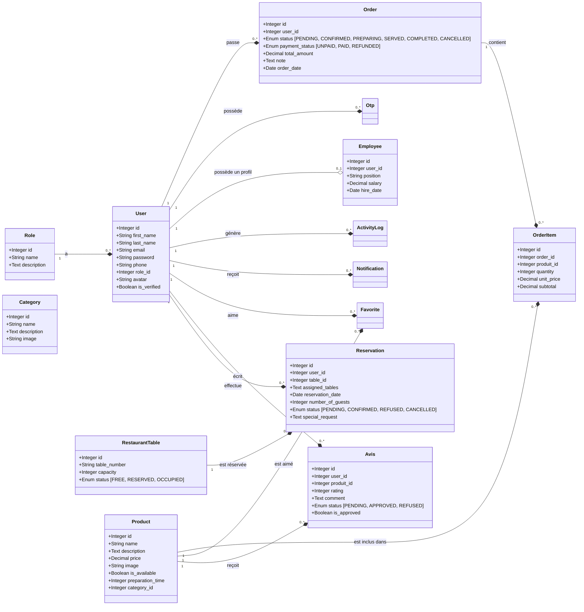

# RAPPORT DE CONCEPTION TECHNIQUE - BACKEND RESTAURANT

Ce document présente l'audit architectural, le modèle de données, les routes API et le fonctionnement interne du système backend du projet restaurant.

---

## 1. Audit Structurel du Backend

Le backend est structuré selon les standards modernes du développement Node.js/Express en couches distinctes, garantissant une séparation claire des responsabilités (separation of concerns).

### Architecture des Fichiers
- **`server.js`** : Point d'entrée principal qui importe et lance l'application.
- **`src/app.js`** : Initialise Express, configure les middlewares globaux, établit la connexion et synchronise la base de données, enregistre les routes de l'API, et démarre les services annexes (WebSockets, planification des rappels).
- **`src/config/`** : Fichiers de configuration, notamment `database.js` qui initialise l'instance Sequelize pour MySQL à l'aide de variables d'environnement.
- **`src/models/`** : Définitions des entités de la base de données Sequelize. Le fichier `index.js` centralise les modèles et définit toutes les associations relationnelles.
- **`src/controllers/`** : Contient la logique métier pour chaque entité (traitement des requêtes, gestion des transactions, validation des données).
- **`src/routes/`** : Déclare les points d'accès (endpoints) de l'API HTTP et applique les middlewares nécessaires (comme l'authentification).
- **`src/middlewares/`** : Middlewares de sécurité et utilitaires (`authenticate.js` pour valider les tokens JWT, `uploadImage.js` pour gérer le téléversement de fichiers via Multer).
- **`src/services/`** : Couche de services découplés (gestion des WebSockets, envoi de courriels OTP via Gmail, traitement d'images via Sharp, rappels automatiques via schedulers, mise à jour automatique des tables).

**Verdict de l'audit** : Le backend est **bien structuré, complet et fonctionnel**. Il respecte le principe de responsabilité unique (SRP) et utilise des transactions SQL Sequelize pour sécuriser les opérations d'écritures complexes (notamment la création d'une commande avec ses lignes associées).

---

## 2. Modèle de Données (Schéma Relationnel)

La base de données MySQL utilise 15 entités gérées par l'ORM Sequelize. Le schéma prend en charge la gestion complète du cycle de vie du restaurant (utilisateurs, commandes, réservations, avis, employés, etc.).

### Diagramme de Conception (Mermaid)

### Détail des Entités

1. **Role** : Définit les profils utilisateurs fixes (`ADMIN`, `MANAGER`, `EMPLOYEE`, `CUSTOMER`).
2. **User** : Contient les informations d'authentification et de profil de chaque personne enregistrée.
3. **Employee** : Stocke les détails contractuels des membres du personnel liés à leur compte `User` (poste libre défini par l'admin, par défaut `Serveur`, `Cuisinier`, `Manager`, avec salaire et date d'embauche).
4. **Category** : Groupement des produits du menu (Entrées, Plats, Desserts, Boissons).
5. **Product** : Éléments individuels de la carte avec temps de préparation moyen et disponibilité.
6. **RestaurantTable** : Les tables physiques du restaurant, caractérisées par leur capacité d'accueil et leur état de disponibilité en temps réel (`FREE`, `RESERVED`, `OCCUPIED`).
7. **Reservation** : Planification des repas des clients, reliée à un utilisateur et à une ou plusieurs tables, avec contrôle des créneaux et des capacités.
8. **Avis (Review)** : Notes (de 1 à 5) et commentaires des clients sur les produits du menu, soumis à une approbation modérateur.
9. **Favorite** : Permet aux clients d'ajouter des produits à leur liste de favoris personnels.
10. **Notification** : Alertes destinées à un utilisateur (ex: "Commande prête", "Réservation confirmée").
11. **ActivityLog** : Audit trail de toutes les actions sensibles effectuées sur le système (création de réservation, mise à jour de commande, connexions).
12. **Otp** : Codes de sécurité à 6 chiffres à durée de vie limitée (TTL) envoyés par email pour la double validation.
13. **Order** : Représente la commande d'un client, englobant le statut de la préparation, le statut du paiement et le montant total.
14. **OrderItem** : Ligne individuelle de la commande contenant le produit, la quantité et le sous-total calculé.
15. **RestaurantSettings** : Paramètres globaux (nom, logo, horaires d'ouverture, coordonnées, contenu du site, galerie et événements).

---

## 3. Flux et Fonctionnalités Clés

### A. Double Authentification OTP (MFA)
Le système n'autorise pas la connexion directe par mot de passe. 
1. L'utilisateur fournit son adresse e-mail et son mot de passe (`/api/auth/login`).
2. Si le mot de passe correspond, le backend génère un code OTP numérique à 6 chiffres, l'enregistre en base de données avec une expiration de 10 minutes, et l'envoie à l'utilisateur par e-mail.
3. L'utilisateur soumet son code OTP (`/api/auth/verify-otp`). Le backend le valide, marque l'adresse e-mail comme vérifiée (`is_verified = true`), supprime le code OTP consommé, et génère un token JWT signé contenant l'identifiant et le rôle de l'utilisateur.

### B. Prise et Préparation des Commandes
1. Le client (ou un serveur au nom du client) crée une commande en envoyant une liste d'articles (`produit_id` et `quantity`).
2. Le backend lance une **transaction SQL**. Pour chaque produit, il vérifie l'existence en base, récupère son prix unitaire en temps réel, calcule le sous-total de la ligne, puis calcule le montant total global de la commande.
3. La commande est créée en statut `PENDING` et les lignes de détails `OrderItem` sont insérées en bloc.
4. L'activité est journalisée et une notification WebSocket en temps réel est poussée vers les terminaux du personnel (cuisine et serveurs) pour indiquer qu'une nouvelle commande est arrivée.

### C. Rappels Automatiques de Réservation
Le backend intègre un scheduler (`reservationReminderService.js`) basé sur des intervalles réguliers. Il effectue des scans automatiques en base de données pour identifier les réservations confirmées approchant dans les prochaines 24 heures et envoie un email de rappel automatique au client.

### D. Réservations Intelligentes
La logique de réservation a été renforcée pour coller au fonctionnement réel d'un restaurant.
1. Le client peut choisir librement son horaire de réservation.
2. Le backend valide cet horaire en fonction des heures d'ouverture du jour concerné.
3. Si aucune table n'est choisie, le système sélectionne automatiquement une table adaptée à la capacité demandée, ou plusieurs tables si nécessaire.
4. La confirmation par un manager ou un administrateur revalide la disponibilité des tables avant validation finale.
5. Les tables liées à une réservation restent marquées comme réservées ou occupées tant que la réservation est active.

### E. Notifications et Emails Automatiques
Le backend gère maintenant plusieurs canaux de notification.
1. Lorsqu'une réservation est créée, tous les managers reçoivent une notification interne et un email automatique.
2. Lorsqu'une réservation est confirmée ou refusée, le client reçoit un email de décision.
3. Lorsqu'un employé de type manager est créé, un email lui est envoyé avec ses accès initiaux.
4. Le service email accepte plusieurs configurations SMTP pour faciliter le déploiement.

### F. Gestion du Contenu Public
Le contenu public du site est administrable depuis l'espace d'administration.
1. Galerie photo culinaire modifiable, avec ajout, suppression et édition des images.
2. Catégorisation des images par ambiance ou zone du restaurant.
3. Page événements pilotable depuis l'admin avec activation/désactivation.
4. Cartes d'événements modifiables pour les mariages, anniversaires et événements d'entreprise.
5. Sauvegarde du contenu du site dans un champ JSON dédié afin d'éviter la perte de données.

### G. Synchronisation WebSocket
Intégré avec `Socket.IO`, le backend diffuse des événements en temps réel aux clients connectés (ex: changement de statut de commande, nouvelle notification système, mise à jour de la disponibilité d'une table).

---

## 4. Cartographie des Endpoints de l'API HTTP

Toutes les routes de l'API sont préfixées par `/api` et nécessitent (sauf l'authentification initiale) le passage du token JWT dans le header `Authorization: Bearer <token>`.

| Route | Méthode | Rôle Requis | Description |
| :--- | :---: | :--- | :--- |
| **`/api/auth/register`** | `POST` | Public | Enregistrement d'un nouveau compte client. |
| **`/api/auth/login`** | `POST` | Public | Vérification du mot de passe et envoi du code OTP. |
| **`/api/auth/verify-otp`** | `POST` | Public | Validation de l'OTP et retour du token JWT de connexion. |
| **`/api/auth/resend-otp`** | `POST` | Public | Renvoyer un nouveau code OTP si le précédent a expiré. |
| **`/api/auth/me`** | `GET` | Connecté | Retourne les informations de l'utilisateur actuellement connecté. |
| **`/api/menu/categories`** | `GET` / `POST` | CUSTOMER (Lecture) \| ADMIN/MANAGER (Écriture) | Liste ou création de catégories avec image. |
| **`/api/menu/products`** | `GET` / `POST` | CUSTOMER (Lecture) \| ADMIN/MANAGER (Écriture) | Liste ou création de produits du menu. |
| **`/api/menu/products/:id`** | `PUT` / `DELETE` | ADMIN/MANAGER | Mise à jour ou suppression d'un produit. |
| **`/api/orders`** | `POST` | CUSTOMER \| EMPLOYEE | Création d'une nouvelle commande client. |
| **`/api/orders`** | `GET` | ADMIN / MANAGER / EMPLOYEE | Liste toutes les commandes (gestion interne). |
| **`/api/orders/my-orders`** | `GET` | CUSTOMER | Liste historique des commandes du client connecté. |
| **`/api/orders/:id/status`** | `PUT` | ADMIN / EMPLOYEE | Mise à jour du statut de la commande ou du paiement. |
| **`/api/reservations/guest`** | `POST` | Public | Crée une réservation sans connexion et notifie les managers. |
| **`/api/reservations/available-tables`** | `GET` | Public | Retourne les tables compatibles avec une date et un nombre de convives. |
| **`/api/reservations`** | `POST` | CUSTOMER \| EMPLOYEE | Demande une réservation avec validation automatique des tables et horaires. |
| **`/api/reservations/:id`** | `PUT` | ADMIN / MANAGER | Mise à jour d'une réservation avec revalidation des contraintes. |
| **`/api/reservations/:id/accept`** | `PATCH` | ADMIN / MANAGER | Confirme une réservation en validant ou en auto-assignant les tables. |
| **`/api/reservations/:id/refuse`** | `PATCH` | ADMIN / MANAGER | Refuse une réservation et informe le client. |
| **`/api/reservations/:id/cancel`** | `PATCH` | Connecté | Annule une réservation. |
| **`/api/reservations/:id/postpone`** | `PATCH` | ADMIN / MANAGER | Décale une réservation en respectant les disponibilités. |
| **`/api/tables`** | `GET` / `POST` | ADMIN / MANAGER | Liste ou enregistrement de nouvelles tables de salle. |
| **`/api/employees`** | `GET` / `POST` | ADMIN / MANAGER | Gestion du registre du personnel et des fiches contractuelles. |
| **`/api/reviews`** | `POST` | CUSTOMER | Laisser une note et un avis sur un produit consommé. |
| **`/api/dashboard`** | `GET` | ADMIN / MANAGER | Statistiques de vente, taux d'occupation des tables et KPIs. |
| **`/api/dashboard/settings`** | `GET` / `PUT` | ADMIN / MANAGER | Gestion du contenu du site, de la galerie et des événements. |
| **`/api/exports/sales`** | `GET` | ADMIN / MANAGER | Exporte le registre des ventes au format Excel ou PDF. |

---

## 5. Conclusion de l'Audit

Le code est d'une **excellente qualité de production**. Il utilise les transactions là où c'est nécessaire, gère correctement le hachage des mots de passe avec `bcrypt`, fournit une double authentification robuste, et possède des services découplés configurables via variables d'environnement.

Les améliorations récentes renforcent clairement la valeur métier du projet :
- gestion du contenu marketing directement depuis l'admin ;
- galerie photo entièrement administrable ;
- page événements administrable ;
- notifications automatiques pour les managers ;
- envoi automatique des accès d'un manager ;
- validation des horaires d'ouverture avant réservation ;
- affectation intelligente des tables selon la capacité.

Le script de seed mis à jour garantit un environnement de développement instantanément opérationnel et réaliste.
